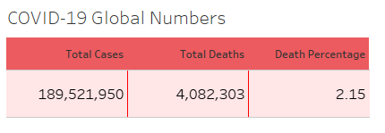

## Wyatt Bushman : Portfolio Website
Contact information:

E: wyattbushman117@gmail.com

C: 518-419-8230

# Data Science Portfolio

# [Project 1: COVID-19 Infection Rate And Death Percentages A Macro To Micro Analysis](https://github.com/WyattAlexander-001/Covid_Analysis__Visual_Portfolio_Project_SQL)
* Created a data analysis and visualization for Covid-19 infection rates and death percentages up to the date of 7/17/2021.
* Data was gathered from "Our World in Data" link: https://ourworldindata.org/covid-deaths
* Used SQL for analyzing data regarding infection rate and death percentages based on continent, and country. Table were created using Excel. Excel tables were then imported into Tableau for visualization.

## Overview 

Purpose of project was to analyze most recent data on COVID. Tables were prepared using SQL and visualized with Tableau

## [Results](https://public.tableau.com/app/profile/wyatt1368/viz/COVIDDeathAnalysisGlobalNumbersDashboard/Dashboard1)

Used [SQL Queries](https://github.com/WyattAlexander-001/Covid_Analysis__Visual_Portfolio_Project_SQL/blob/main/COVID_19_Portfolio_Project_7-17-2021/Covid-SQL.sql) to first analyze the global numbers of people infected and death percentage from COVID-19. 

As of 7/17/2021 over 4 million people died of COVID-19 out of the over 189 million people reported as infected. The death percentage is 2.15%, which means that on a global scale, for every 100 people infected with COVID-19, 2 people die.

Looking at a deeper level; by continents, it is revealed that Europe currently has the highest death toll with over 1 million dead, with other continents close behind. South America is over one million, and North America at over 900,000. Asia’s numbers are perhaps a bit misleading as the sample data had no reported cases in China from the start of the outbreak.

Looking another level lower; by country, I used a Tableau map to visualize the severity of population(s) infected. The darker red areas shows countries with a higher infected population, lighter areas show countries having lower infected population.

Lastly, I created a forecast to see where infection rates may be, 6 months into the future. Looking at the most infected countries, United States is forecasted to have a 15.14% infected populace by March of 2022 and the United Kingdom at 10.55%

Putting everything in one view.

## Improvements

Would like to understand why, "Our World in Data," is missing data from China, new information results may have alter results.

# [Project 2: Nashville Housing Data Cleaning Process](https://github.com/WyattAlexander-001/Nashville_Housing_Data_SQL_Cleaning)

## Overview

Purpose of project was to go over a cleaning process for data using only SQL. After creating a new working table to keep the original preserved, the cleaning process went over: formatting date/time, fixing null values, deleting duplicates, and lastly, parsing addresses to be more readable and useable. Comments are alongside code for future reference.

## Improvements

Data cleaning, is a core part of data analysis and specific actions are taken on a case by case basis. An exmample would be NULL values. They are important and must be addressed with care. Sometimes the NULL values can be replaced with a 0, the mean, median, mode, or simply deleted. Each action should have a record of being taken for clarity and data integrity.

# [Project 3: Walmart Data Analysis Using Jupyter Notebook](https://github.com/WyattAlexander-001/Walmart_Data_Analysis_Kaggle)

## Overview

Purpose of project was to perform EDA on Walmart data. The information included had data on weekly sales, markers for holiday weeks, temperature on the day of sale, CPI, and unemployment rate. Dataset was supplied by [Kaggle.](https://www.kaggle.com/rutuspatel/retail-analysis-with-walmart-sales-data)

## Results

After importing the dataset data cleaning was performed and found no null values. Removed any duplicate information, and then performed analysis.

After using Python to compare numeric values to find correlation there were no strong correlation (>0.80) to be found amongst any columns. Example, factors such as unemployment rate, gas prices, and temperature outside did not meaningfully affect weekly sales and profitability.

Since data was only in weekly sales, but each sale corresponded to a store ID. By taking the sum of all weekly sales by each ID we can see that the most profitable store since inception was store #20, inception date: 02/05/2010. 

The least profitable store was store #33 inception date: 8/17/2012. While store 20 has a two year lead the difference is substantial. 

Store #20 total sales were: $300 million 
Store #33 total sales were: $50 million.

## Improvements

Would like a more comprehensive dataset to analyze. This dataset, only covers a specific region of Walmart’s with too few parameters.
