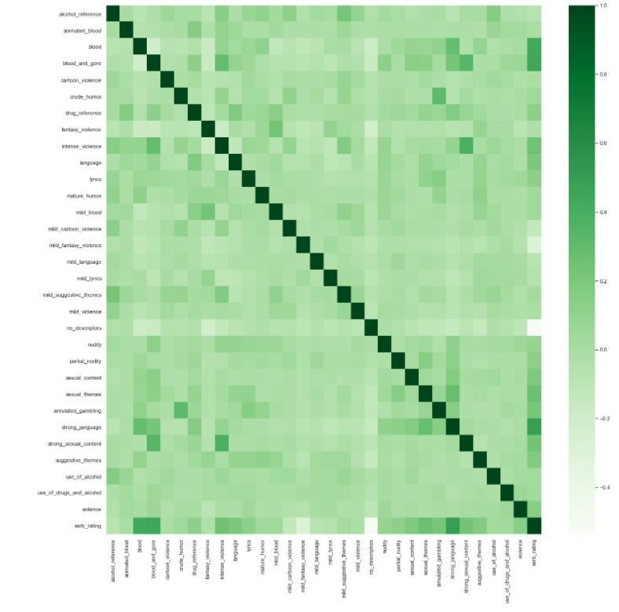

## Wyatt Bushman : Portfolio Website
Contact information:

Email: wyattbushman117@gmail.com

Cell: 518-419-8230

# Data Science Portfolio

# [Project 1: COVID-19 Infection Rate And Death Percentages A Macro To Micro Analysis](https://github.com/WyattAlexander-001/Covid_Analysis__Visual_Portfolio_Project_SQL)
* Created a data analysis and visualization for Covid-19 infection rates and death percentages up to the date of 7/17/2021.
* Data was gathered from "Our World in Data" link: https://ourworldindata.org/covid-deaths
* Used SQL for analyzing data regarding infection rate and death percentages based on continent, and country. Table were created using Excel. Excel tables were then imported into Tableau for visualization.

## Overview 

Purpose of project was to analyze most recent data on COVID. Tables were prepared using SQL and visualized with Tableau

## [Results](https://public.tableau.com/app/profile/wyatt1368/viz/COVIDDeathAnalysisGlobalNumbersDashboard/Dashboard1)

Used [SQL Queries](https://github.com/WyattAlexander-001/Covid_Analysis__Visual_Portfolio_Project_SQL/blob/main/COVID_19_Portfolio_Project_7-17-2021/Covid-SQL.sql) to first analyze the global numbers of people infected and death percentage from COVID-19. 

As of 7/17/2021 over 4 million people died of COVID-19 out of the over 189 million people reported as infected. The death percentage is 2.15%, which means that on a global scale, for every 100 people infected with COVID-19, 2 people die.

Looking at a deeper level; by continents, it is revealed that Europe currently has the highest death toll with over 1 million dead, with other continents close behind. South America is over one million, and North America at over 900,000. Asia’s numbers are perhaps a bit misleading as the sample data had no reported cases in China from the start of the outbreak.

Looking another level lower; by country, I used a Tableau map to visualize the severity of population(s) infected. The darker red areas shows countries with a higher infected population, lighter areas show countries having lower infected population.

Lastly, I created a forecast to see where infection rates may be, 6 months into the future. Looking at the most infected countries, United States is forecasted to have a 15.14% infected populace by March of 2022 and the United Kingdom at 10.55%

Putting everything in one view.

## Improvements

Would like to understand why, "Our World in Data," is missing data from China, new information results may have alter results.

# [Project 2: ESRB Rating System Analysis Using Jupyter Notebooks](https://github.com/WyattAlexander-001/ESRB_Rating_Analysis/blob/main/ESRB/ESRB_V1.ipynb)

## Overview

Purpose of this project was to analyze and predict the efficiency of the ESRB Rating System using Python's Jupyter Notebooks via the Anaconda Data Science Suite.
* Verified integrity and cleaned data
* Created visualization of ESRB rating system in Jupyter Notebooks.
* Implemented decision tree and random forests model to predict ESRB rating accuracy.

## Results

# Prep Work

Prior to visualizations, I made sure to import the appropriate data science libraries (NumPy, Pandas, matplotlib). Performed EDA on data, which is checking the number of rows and columns, and then performed data wrangling which is to verify if data has no null values. The data was clean with zero null values. [All code can be found here with accompanying comments.](https://github.com/WyattAlexander-001/ESRB_Rating_Analysis/blob/main/ESRB/ESRB_V1.ipynb)

# Checked correlation of all columns and found correlation between ESRB rating and common themes ESRB criteria flags, eg: (blood, gore, sexual themes, violence, strong language)

# Visualize The Gap Between Violence and Kid Friendly
I then visualized the large differences in volumes of these ESRB flags. There were more games with ESRB criteria flags than games without Them. Examples below include: blood, gore, and strong language.

# Blood

# Gore

# Strong Language

# Majority of Games With ESRB flags are M and T Rated. 

Interesting enough, while many games with blood and strong language are found in the M rating, which is to be expected. The majority of games in total, and include these themes are in the "T" rating.

# A pie chart showing all the ratings

# Performed Decision Tree Classifier & Random Forests

To verify the accuracy of the ESRB, I implemented I created a decision tree classifier and random forests model. The results were both greater than 80% showing that the ESRB rating system is an effective tool in classifying video games via their mature themes.

# Conclusion

The ESRB rating is an effective method to rate video games based on their mature themes with an accuracy rating of 85%

# Improvements

Would like to run same test but on video games from all generations. The ESRB rating was introduced during the 16-bit era of video games so you would likely excluded the eras before it.

# [Project 3: Nashville Housing Data Cleaning Process SQL](https://github.com/WyattAlexander-001/Nashville_Housing_Data_SQL_Cleaning)

## Overview

Purpose of this project was to go over a cleaning process for data using only SQL. After creating a new working table to keep the original preserved, the cleaning process went over: formatting date/time, fixing null values, deleting duplicates, and lastly, parsing addresses to be more readable and useable. Comments are alongside code for future reference.

## Improvements

Data cleaning, is a core part of data analysis and specific actions are taken on a case by case basis. An exmample would be NULL values. They are important and must be addressed with care. Sometimes the NULL values can be replaced with a 0, the mean, median, mode, or simply deleted. Each action should have a record of being taken for clarity and data integrity.

# [Project 4: Walmart Data Analysis Using Jupyter Notebook](https://github.com/WyattAlexander-001/Walmart_Data_Analysis_Kaggle)

## Overview

Purpose of project was to perform EDA on Walmart data. The information included had data on weekly sales, markers for holiday weeks, temperature on the day of sale, CPI, and unemployment rate. Dataset was supplied by [Kaggle.](https://www.kaggle.com/rutuspatel/retail-analysis-with-walmart-sales-data)

## [Results](https://github.com/WyattAlexander-001/Walmart_Data_Analysis_Kaggle/blob/main/Walmart_Data_Analysis.ipynb)

After importing the dataset data cleaning was performed and found no null values. Removed any duplicate information, and then performed analysis.

After using Python to compare numeric values to find correlation there were no strong correlation (>0.80) to be found amongst any columns. Example, factors such as unemployment rate, gas prices, and temperature outside did not meaningfully affect weekly sales and profitability.

Since data was only in weekly sales, but each sale corresponded to a store ID. By taking the sum of all weekly sales by each ID we can see that the most profitable store since inception was store #20, inception date: 02/05/2010. 

The least profitable store was store #33 inception date: 8/17/2012. While store 20 has a two year lead the difference is substantial. 

Store #20 total sales were: $300 million 
Store #33 total sales were: $50 million.

## Improvements

Would like a more comprehensive dataset to analyze. This dataset, only covers a specific region of Walmart’s with too few parameters.

# [Project 5: Palmer Penguin Analysis Body Mass And Flipper Length With The R Programming Language](https://github.com/WyattAlexander-001/R_Palmer_Penguin_Analysis)

# Overview

Purpose of project was to import the "Palmer Penguins" dataset, and see the correlation between body mass and flipper length. The three penguin species were: Adelie, Gentoo, and Chinstrap.

# Results

There was a positive correlation between flipper length and body mass, and the penguins with the largest body mass and flipper length are the Gentoos. The bigger the penguin, the larger the flipper mass, and this was present across all three species.

First, a scatter plot was made to see the general correlation between flipper length and body mass.

Secondly, after seeing a clear correlation between flipper length and bodymass, three separate graphs were made to highlight the differences between all the species

Lastly, to wrap up, a final graphic was made to show how they compare to one another. The conclusion was that there is a strong correlation between flipper length and bodymass, with Gentoos being the largest. 

# Results

# [Project 6: Hotel Booking Data Analysis With The R Programming Language ](https://github.com/WyattAlexander-001/R_Data_Cleaning_Hotel_Bookings)

# Overview

Purpose of project was to import the hotel dataset, clean and then present visuals. Analysis focused on hotel bookings, and wanted tot he answer the question, "If the guest(s) have children, does that affect their bookings compared to guest(s) without children?"   

## Results

# Cleaning process 
*Renamed hotel to hotel_type to be more specific
*Combined month and year into one column with unite
*Created new column that summed all the adults, children, and babies on a reservation for the total number of people

#Analysis
*Found total number of canceled bookings and average lead time for booking
*Found guest(s) with children do not affect hotel booking (Image 1)
*Found guest(s) without children book more weekend nights (Image 2)

# Children do not affect hotel booking timing

# Guests without children book more weekend nights

